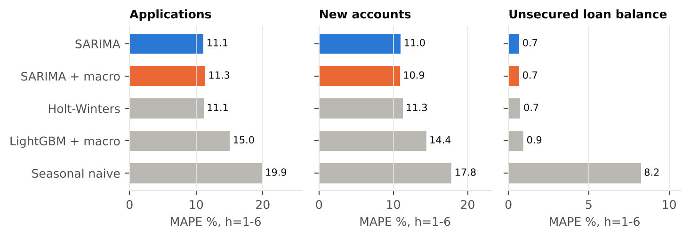
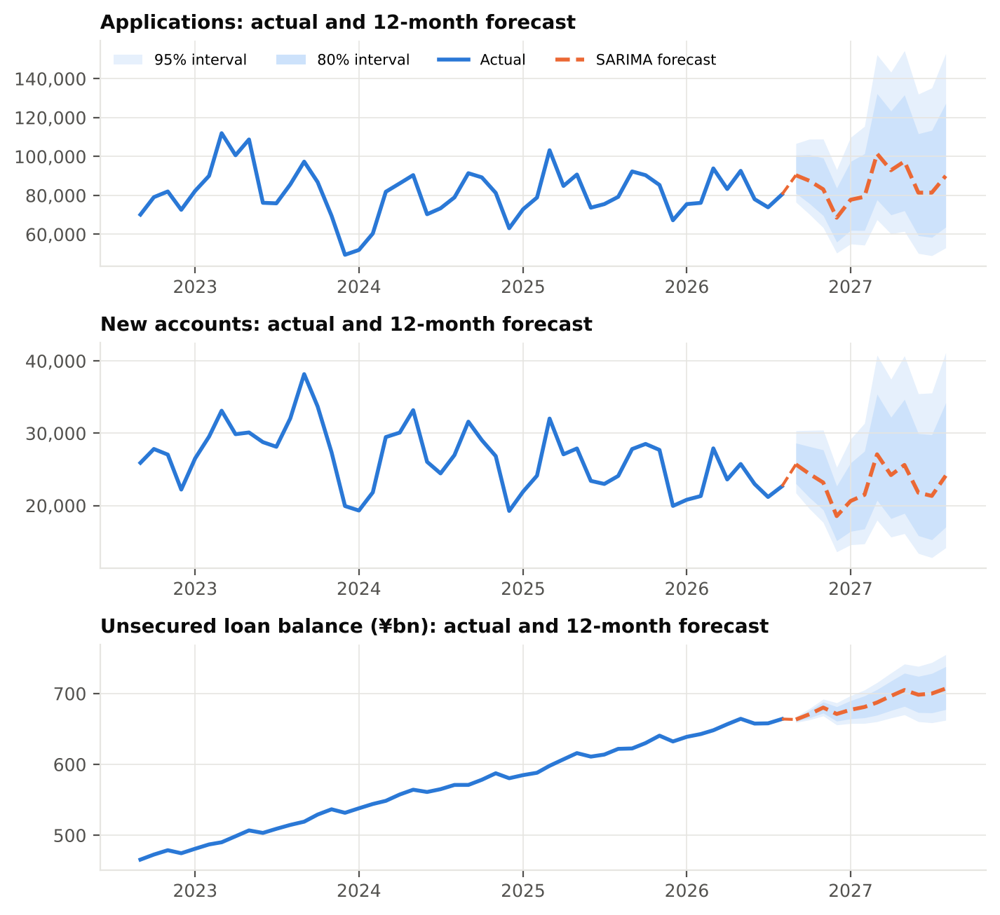

# Forecasting AIFUL's monthly business with public data

Can Japanese macro data (unemployment, consumer confidence, inflation) improve forecasts of a
consumer-finance company's monthly KPIs beyond a plain time-series model?

This project rebuilds **AIFUL Corporation's** monthly operating data (Apr 2013 to Aug 2026) from the
PDFs its parent, Muninova Holdings, publishes on its IR site. It joins that data to official Japanese
statistics, forecasts applications, new accounts and the unsecured loan balance, and turns the results
into a **monthly business performance report written for management**.

📄 **Report:** [`reports/AIFUL_Monthly_Performance_Report_2026-08.pdf`](reports/AIFUL_Monthly_Performance_Report_2026-08.pdf)
📓 **Walkthrough:** [`notebooks/aiful_forecasting_walkthrough.ipynb`](notebooks/aiful_forecasting_walkthrough.ipynb)

> Independent analysis using public data only. Not affiliated with AIFUL or Muninova Holdings.

---

## Key findings (data to August 2026)

| | |
|---|---|
| **Demand flat, conversion falling** | Applications +1.0% FYTD, but new accounts -7.4%: the contract rate fell from 31.0% to 28.4% |
| **Book still compounding** | Unsecured balance ¥664bn, +6.8% YoY (down from ~9%) |
| **Credit quality improving** | Delinquent-loan ratio 0.654% vs 0.749% a year earlier, consistent with tighter screening |
| **Best model** | SARIMA cuts error vs seasonal naive by 44% (applications), 38% (new accounts), 92% (balance) |
| **Macro value** | **None out of sample.** No driver set improves 1-6-month MAPE by more than ~0.4pt; at h=1 macro significantly *hurts* (DM test p≈0.02) |
| **Why** | In-sample, new accounts respond *counter-cyclically* to confidence and unemployment (p≈0.03), but that effect is small next to company-driven swings in marketing, credit policy and the digital shift |

**Takeaway for management:** volumes are driven by AIFUL's own levers, so forecasting and monitoring
should centre on internal funnel and channel data. Macro indicators belong on a risk watch-list.




---

## Data

| Source | Series | File |
|---|---|---|
| [Muninova Holdings IR – Monthly Data](https://www.muninova.co.jp/en/ir/finance/monthly_data.html) | Applications, new accounts, contract rate, loan balances by segment, accounts, interest-refund claims, delinquency ratio | `data/raw/aiful_MD_FY*.pdf` (14 PDFs) |
| Statistics Bureau, Labour Force Survey (via FRED `LRHUTTTTJPM156S`) | Unemployment rate, SA | `aiful_macro_fred_*.csv` |
| Cabinet Office ESRI, Consumer Confidence Survey (e-Stat) | Consumer Confidence Index + sub-indices, SA | `aiful_macro_consumer_confidence_SA.xlsx` |
| Statistics Bureau, CPI 2025 base (e-Stat) | CPI and core CPI, YoY | `aiful_macro_cpi_yoy_middle_class.csv` |
| OECD/BoJ via FRED | Hourly earnings growth, call rate, USD/JPY | `aiful_macro_fred_*.csv` |

**Parsing and validation.** The PDF layout changed over time (FY2014-2018 files are landscape and
transposed). `src/parse_monthly_pdfs.py` maps each number to its month column by x-coordinate, so one
parser handles every vintage. Each parsed level was checked against the YoY % printed in the same PDF:
all 149 overlapping months match within 0.05pt. The published contract rate also equals new accounts ÷
applications.

**Known breaks, modelled explicitly:**
- **Jun 2023:** AIFUL disclosed that applications had been over-counted (duplicates); counting changed from June 2023. Handled with a step dummy.
- **Apr-Jun 2020:** first COVID state of emergency. Handled with an intervention dummy.
- Monthly account counts exclude part of the former LIFE receivables except at quarter-ends.

## Method

- **Targets:** applications, new accounts, unsecured personal-loan balance (monthly, log scale)
- **Models:** seasonal naive · Holt-Winters (damped) · SARIMA(1,1,1)(0,1,1)₁₂ · the same SARIMA + macro · LightGBM direct multi-horizon
- **Fair comparison:** SARIMA and SARIMA + macro share identical intervention dummies, so macro is the only difference
- **No look-ahead:** macro drivers are lagged 6 months, so every value is already published for h ≤ 6
- **Evaluation:** expanding-window rolling origin, 54 origins (Sep 2021 to Feb 2026), h = 1-6, MAPE + Diebold-Mariano test
- **Robustness:** five alternative macro driver sets (`reports/tables/macro_robustness_mape.csv`)

## Channels

AIFUL says more than 90% of applications are now online, with app-only contracting and cardless
withdrawals at Seven Bank and Lawson Bank ATMs. The public monthly data has **no channel split**, so
Section 5 of the report sets out how the model would extend with internal data:
- shift-share decomposition of the contract rate (channel mix vs within-channel conversion)
- hierarchical channel forecasts reconciled to the corporate total (MinT)
- marketing spend as adstock regressors
- cardless/app usage cohorts
- vintage-based early warning on delinquency

## Repository layout

```
data/raw/          source PDFs and macro files exactly as downloaded
data/processed/    tidy monthly KPI table, macro panel, every backtest forecast
src/
  parse_monthly_pdfs.py   PDF -> tidy KPIs (+ published YoY for validation)
  build_macro.py          macro driver panel
  forecasting.py          models, interventions, backtest, DM test, final forecast
  run_backtest.py         54-origin backtest -> reports/tables
  robustness.py           alternative macro driver sets
  make_report_assets.py   scorecard, 12-month forecasts, scenarios, figures
  build_report.py         management PDF (all numbers read from tables)
notebooks/         walkthrough of validation, signal, backtest and forecast
reports/           PDF report, figures, tables
run_all.py         one command end to end
```

## Reproduce

```bash
pip install -r requirements.txt
python run_all.py          # full run, ~15 min (backtests)
python run_all.py --fast   # reuse backtest tables, rebuild forecasts + report
```

**Monthly update:** drop the new monthly PDF into `data/raw/`, refresh the macro files, then run
`python run_all.py`. The scorecard, forecasts and report regenerate automatically.
